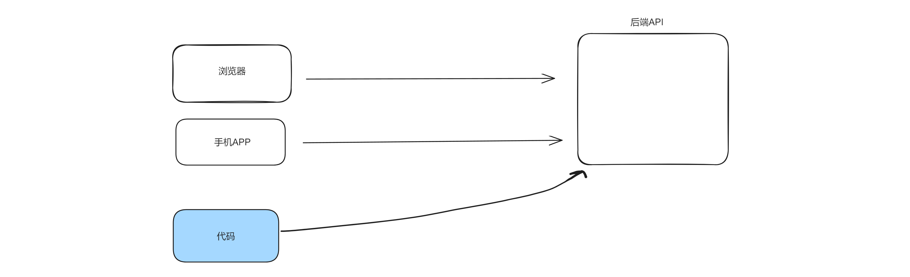

# 1. 什么是爬虫？

用代码代替人去模拟**浏览器**或**手机**去执行执行某些操作。

例如：
   - 自动登录钉钉，定时打卡
- 去91自动下载图片/视频
- 去京东抢茅台




# 3.分析&模拟

分析一个网址，用requests请求就可以实现。


## 3.1 请求分析

基于谷歌浏览器去分析。


## 3.2 模拟请求

基于requests模块发送请求。

```
pip3.11 install requests
```


# 案例1：花瓣网

https://huaban.com/

https://huaban.com/search?q=%E5%86%99%E7%9C%9F&sort=all&type=pin


# 案例2：腾讯课堂

https://ke.qq.com/course/list?mt=1001&quicklink=1&st=2056

```
res = requests.post(
    url="https://ke.qq.com/cgi-proxy/course_list/search_course_list?bkn=&r=0.0241",
    json={"mt": "1001", "st": "2056", "visitor_id": "5824118981510182", "finger_id": "c13d4a59f03ab3923748c030ff18aa58",
          "platform": 3, "source": "search", "count": 24, "need_filter_contact_labels": 1},
    headers={
        "Referer": "https://ke.qq.com/course/list?mt=1001&quicklink=1&st=2056"
    }
)
```


